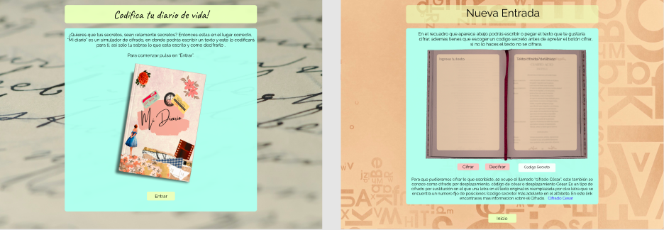

# Mi Diario

Mi diario es una pagina web en donde podrás simular como se vería tu diario de vida si lo cifraras con el "cifrado cesar", en el puedes interactuar escribiendo un texto y escogiendo un numero secreto ( numero que utilizaremos para hacer funcionar el cifrado cesar ), luego el simulador te mostrara el texto ya cifrado, ademas podrás decifrar tu mensaje utilizando el mismo código secreto que escogiste al momento de cifrarlo. 
Esta web esta mayoritariamente dirigida a publico femenino, dentro de un rango de edad de 15 a 25 años.

Puedes acceder a la web aquí:

[Mi Diario](https://rose-aravena.github.io/SCL020-cipher/)

## Prototipo

ve el prototipo con las interacciones
* [Prototipo] (https://www.figma.com/proto/tLU3LmyaxdA5NEAP19B58J/mi-diario?node-id=1%3A4)

## Bitácora de desarrollo

* Dia 1
 -Definicion del tema en el cual se va a trabajar (se escoge cipher).
 -Se comparte conocimientos y opiniones sobre el tema.

* Dia 2 
  - se empieza a prototipar el proyecto, se define que se hara un simulador de "diario de vida cifrado", en donde nuestro publico objetivo sera mayoritaria mujeres entre los 15 a los 25 años. ya que en ese rango de edad es donde mas mujeres mantienen un diario de vida. 
  El simulador es una herramienta para que puedan cifrar entradas de sus diario y ver como queda, de esta forma aprenderan a resolver el problema de privacidad en sus diarios ya que muchas veces se ocupan diarios fisicos que no tienen mayor seguridad o digitales con claves que despues se puedan olvidar.
  - se crea un primer prototipo de como se veria la vista del simulador. 

* Dia 3
  - se realiza el prototipo en gama media.
  - se crea la pagina principal y la segunda vista donde esta el simulador de cifrado.

* Dia 4
  - creacion de recursos visuales (libro)
  - avances en CSS 
  - feedback con las compañeras (presentacion de la idea y el diseño basico de la pagina)

* Dia 5
 - avances en el diseño de la pagina (css)
 - investigacion para las funciones en JS

* Dia 6
  - investigacion funciones JS

* Dia 7
  - avances JS
  - enlazar archivos JS

* Dia 8
 - avances en js
 - realizacion de los primeros test

* Dia 9
- Demos y feedback

* Dia 10
- revisar código para el test

* Dia 11
- lograr que test corra correctamente
- repaso de funciones
- afinar detalles en css

* Dia 12
- agregar textos del prototipo a html's
- repaso de funciones
- estudio de excepciones

* Dia 13
- pedimos feedback a nuestras compañeras sobre el diseño de nuestra pagina
- modificaciones en nuestro css
- repasamos nuevamente los test 
